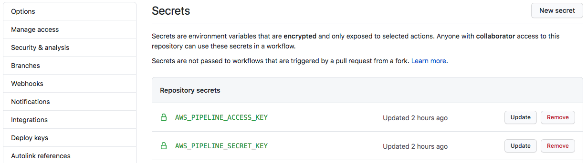

## GitHub Actions x AWS CodePipeline

This GitHub Actions will help you trigger a pipeline in your AWS CodePipeline - assumming you already have the pipeline. This will not create the pipeline for you.

## Setup

### AWS IAM

Create an IAM user with `codepipeline:StartPipelineExecution` permission. You may take and customize the IAM policy below as starter point. Note that I'm using `"*"` in the policy. For better security, you can limit the policy to only execute specific pipelines. You can read more about IAM for CodePipeline [here](https://docs.aws.amazon.com/codepipeline/latest/userguide/permissions-reference.html).

```
{
    "Version": "2012-10-17",
    "Statement": [
        {
            "Effect": "Allow",
            "Action": [
                "codepipeline:StartPipelineExecution"
            ],
            "Resource": [
                "*"
            ]
        }
    ]
}
```

### GitHub Secrets

After you create the IAM user with the right permission, add two variables below in your GitHub repository secrets area:

- `AWS_PIPELINE_ACCESS_KEY`: the Access Key ID for the user that you just created
- `AWS_PIPELINE_SECRET_KEY`: the Secret Key for the user that you just created



## Usage

### Basic Usage

**Note**:

- Please check the latest available version [here](https://github.com/marketplace/actions/aws-codepipeline-trigger) and replace it with `X.X.X` in the code examples below.

- Identify in which AWS region your pipeline is located. Use that region name for `aws-region` key below. AWS regions list is available [here](https://docs.aws.amazon.com/general/latest/gr/rande.html#regional-endpoints).

```
jobs:
  deploy:
    steps:
      - name: Trigger AWS CodePipeline
        uses: zulhfreelancer/aws-codepipeline-action@vX.X.X
        with:
          aws-region: "ap-southeast-1"
          aws-access-key: ${{ secrets.AWS_PIPELINE_ACCESS_KEY }}
          aws-secret-key: ${{ secrets.AWS_PIPELINE_SECRET_KEY }}
          pipeline-name: "your-pipeline-name"
```

### Advance Usage

Below is the example for situation where:

- You only want to trigger the pipeline if previous job was successful
- You only want to trigger the pipeline if the Git branch that GitHub Actions currently running is a specific branch

```
jobs:
  job1:
    ... code for job1 ...
  deploy:
    needs: job1
    runs-on: ubuntu-latest
    steps:
      - uses: actions/checkout@v2
      - name: Trigger AWS CodePipeline
        uses: zulhfreelancer/aws-codepipeline-action@vX.X.X
        if: github.ref == 'refs/heads/your-branch-name'
        with:
          aws-region: "ap-southeast-1"
          aws-access-key: ${{ secrets.AWS_PIPELINE_ACCESS_KEY }}
          aws-secret-key: ${{ secrets.AWS_PIPELINE_SECRET_KEY }}
          pipeline-name: "your-pipeline-name"
```

## Optional - Fail the workflow if CodePipeline call returns an error
By default, only a log message is displayed if Codepipeline call returns an error, but the workflow is not marked as failed.

By setting the input `fail-on-error` to `true` (`True` or `TRUE` are also accepted), the Github workflow will be marked as failed, and will interrupt the workflow run.


```
jobs:
  deploy:
    steps:
      - name: Trigger AWS CodePipeline
        uses: zulhfreelancer/aws-codepipeline-action@vX.X.X
        with:
          aws-region: "ap-southeast-1"
          aws-access-key: ${{ secrets.AWS_PIPELINE_ACCESS_KEY }}
          aws-secret-key: ${{ secrets.AWS_PIPELINE_SECRET_KEY }}
          pipeline-name: "your-pipeline-name"
          fail-on-error: "true"
```

## Contribute

Feel free to fork and submit PRs for this project. I'm more than happy to review and merge it. If you have any questions regarding contributing, feel free to reach out to me on [Twitter](https://twitter.com/zulhhandyplast).
